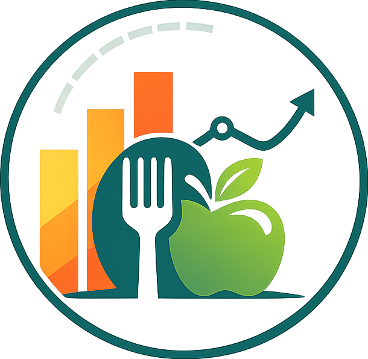
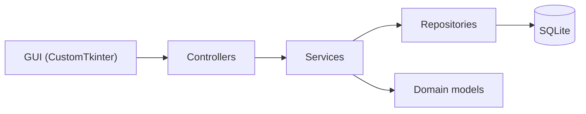

<div align="center">
  
  <h1>Проект: calorie_tracker_toma</h1>
  <p><b><i>Десктоп‑трекер калорий: авторизация, профиль, приёмы пищи, прогресс и отчёты</i></b></p>
  <div style="display: flex; justify-content: center; gap: 8px; flex-wrap: wrap;">
    
    
    
    
    
  </div>
</div>

## ✨ Возможности

- Регистрация и вход, хранение сессии пользователя;
- Профиль: рост/вес/возраст/пол, дневная цель калорий;
- Добавление приёмов пищи и расчёт дневного прогресса;
- Отчётность и визуализация (графики).

---

## 🧱 Архитектура



- `app/domain` - доменные сущности и интерфейсы репозиториев;
- `app/repositories` - реализация хранилищ на SQLAlchemy + SQLite;
- `app/services` - бизнес-логика (авторизация, калории, прогресс, профиль);
- `app/gui` - GUI (окно авторизации + главное окно с вкладками);
- `app/utils` - безопасность, логирование, работа с сессией, исключения.

---

## 🚀 Запуск

```powershell
# создай и активируй окружение
py -m venv .venv
.\.venv\Scripts\Activate.ps1

# установи зависимости
pip install -U pip
pip install -e .

# мигрируй бд и запусти приложение
py .\init_db.py
py .\run.py
```

---

## ⚙️ Конфигурация

Основные пути и параметры описаны в [config.py](./app/config.py):

- БД: `calories.db` (SQLite) в корне проекта
- Файл сессии: `.session`
- Логи: `calorie_tracker.log`

---

<div align="center">
  
  <br>
    <sub><b>Десктоп-приложение // Трекер калорий</b></sub>
    <br>
    <sup><i>Made with cranch by <a href="https://github.com/nineteentearz" target="_blank" title="nineteentearz">nineteentearz</a></i></sup>
</div>
